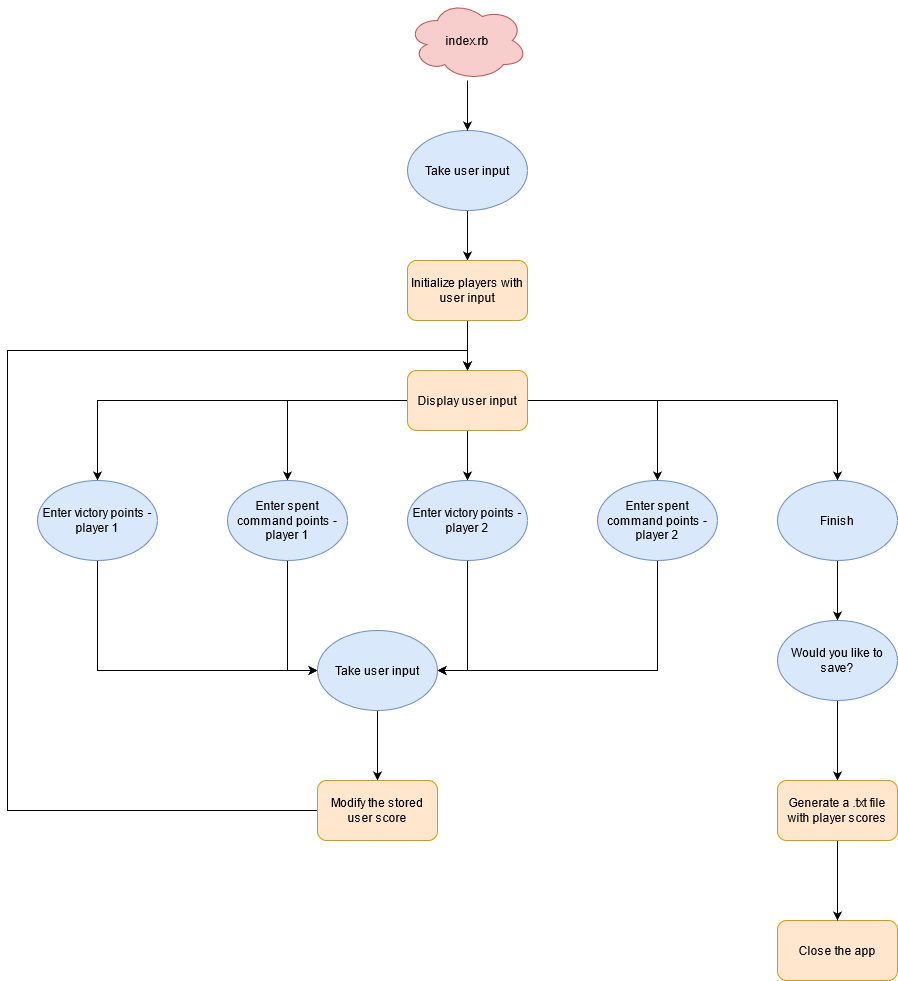
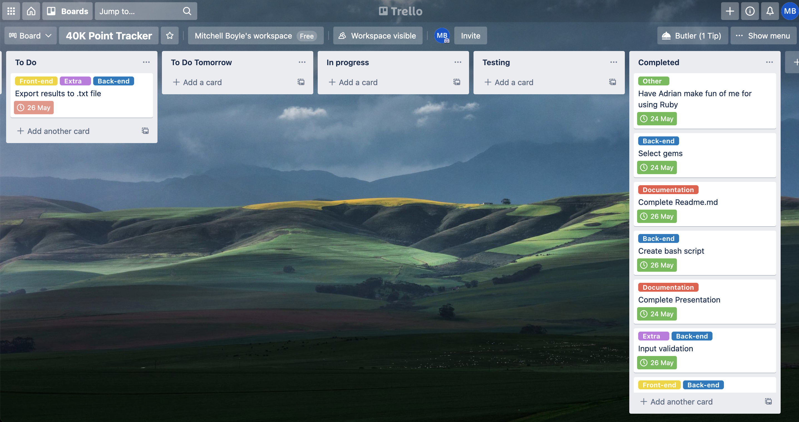

# 40k Point Tracker

The 40k Points Tracker application was developed to assist players of Warhammer 40k, the table top war game. It tracks the 2 players primary, secondary and command points so you can focus on just the game.

Github Link: https://github.com/BroadwayAus/terminal_app

# System requirements

This app uses Ruby version 2.7.1. Bundler version 2.1.17 was used for Ruby gem management.

# Installation and Execution

First clone the repository onto you machine.

``` 
$ git clone https://github.com/BroadwayAus/terminal_app 
```

`cd` into the the `src` folder and run the `install.sh` script

```
./install.sh
```
This will install all the required dependencies.

Now you can run the application by using the command
```
ruby index.rb
```

# Ruby Gems

This current build utilizes the following Gems
- TTY-Prompt - Version:  0.23.1
- Colorize - Version 0.8.1

# ASCII Art
The ASCII art in this project was generated using - https://fsymbols.com/generators/carty/

# Features

This application uses a `Class` system to keep track and store user input relating to the current players, including their name and which army they are currently playing. This `Class` has a method `display_score` that is called upon to show to the user the current scores of the players.

In the case of players accidentally entering incorrect information, there is validation in place to make sure that the players cannot enter a `String` where an `Integer` is meant to be and vice versa. This was accomplished using Regular Expression. I have also implemented a way of over riding player scores in case the user enters the incorrect information of the correct data type.

All these feature are accessable via the main menu which was created using `TTY-Prompt` which is an interactive menu that takes in user input in the form on the arrow keys in the enter key.

# Control Flow




# Planning

